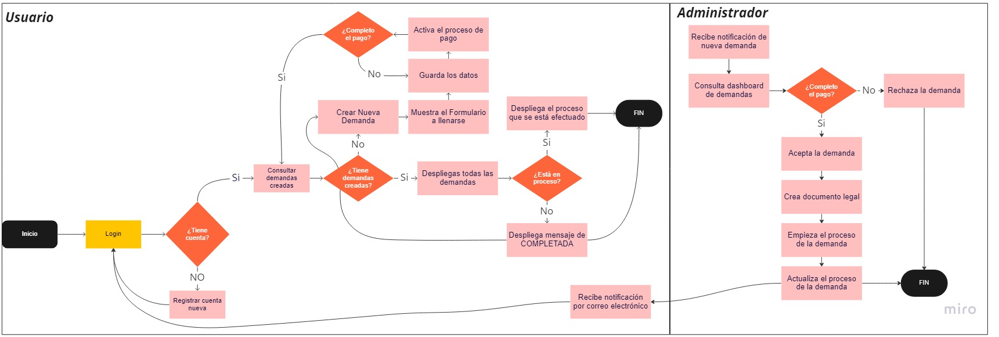

# Abogabot

 **Fecha de Solicitud:** 20 de Noviembre del 2022
 
 **Responsable(s) Solicitud:** Launch X
 
 **Descripción de Solicitud:**
 - El sistema enviara una encuesta al usuario y la procesara para su revision.
 - Procesa y envía información al administrador
 - Cobra por servicio y registra las ganancias
 - Registra usuarios y guarda su info. para que puedan acceder a ella en otros dispositivos
 - El administrador comunica al cliente cualquie modificación en la demanda

 **Requisitos**
 - La página web deberá ser *responsive* para acceder desde el celular
 - Abogabot, se podrá utilizar en plataformas web y móvil, para poder realizar el seguimiento de las actualizaciones del proceso legal.
 - La paleta de colores escogida para el cliente será la siguiente: https://colorhunt.co/palette/06283d256d8547b5ffdff6ff 

 

 - La comunicación se dará a través de notificaciones en la app, pero si el cliente quiere hablar directamente con el Admin se podrá realizar por correo electrónico

 # Análisis de Requisitos y Requerimientos

 **Diagrama BPM**

 # Requisitos Técnicos

 **Tipo de Desarollo:** Web
 
 **Base de Datos:** MySQL
 
 **Lenguaje:** HTML
 
 **Diagrama de Planeación**
 
 **Proceso**

[Volver &ldca;](/Launch/Practica1/README.md "Regresar a página anterior")