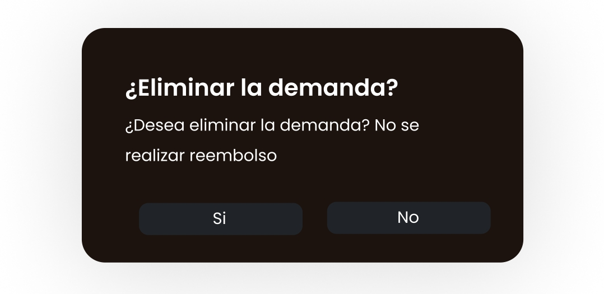

# Abogabot UI

Se puede ver el archivo figma en el siguiente link: 

https://www.figma.com/file/B3qcqubwuAOzPv20aZCQvi/Untitled

Las siguientes imagenes muestran un ejemplo de la interfaz UI de Abogabot, la interfaz está sujeta a cambios

**Interfaz del Usuario**

 - Login

 - Register

 - Dashboard

 - Nueva Demanda

 - Editar Demanda

 - Ver Progreso de la Demanda

- Eliminar Demanda

 - Realizar el Pago

 - Confirmar el Pago

 

 - Pago Exitoso

[Volver &ldca;](/Front/Practica1/README.md "Regresar a página anterior")