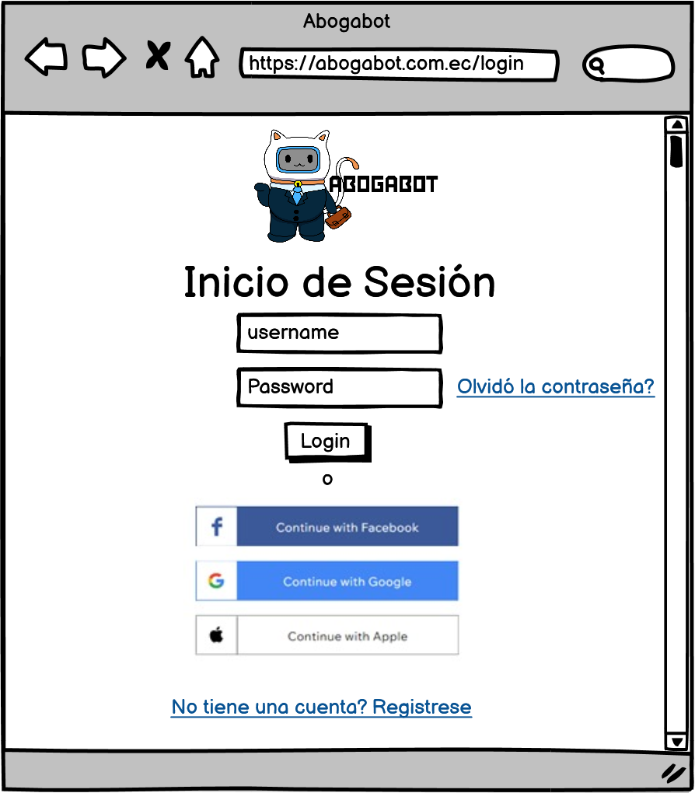

# Wireframe Boceto en Papel

**Wireframes del Usuario**

**Wireframes del Administrador**

# Wireframe Boceto Diseños Digitales

**Wireframes del Usuario**

 - Login

 - Register

 - Dashboard

 - Nueva Demanda

 - Editar Demanda

 - Ver Progreso de la Demanda

 - Realizar el Pago

 - Pago Exitoso

**Wireframes del Administrador**

 - Dashboard Administrativo

 - Aceptar o Rechazar Demanda

 - Actualización de Demanda

 - Confirmación de Actualización

[Volver &ldca;](/Front/Practica1/README.md "Regresar a página anterior")