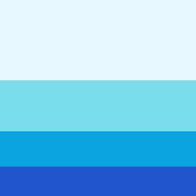
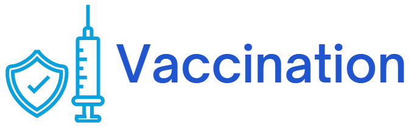
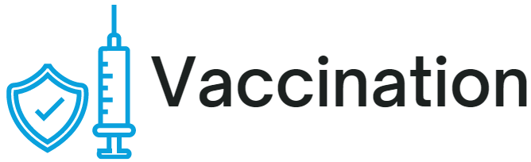
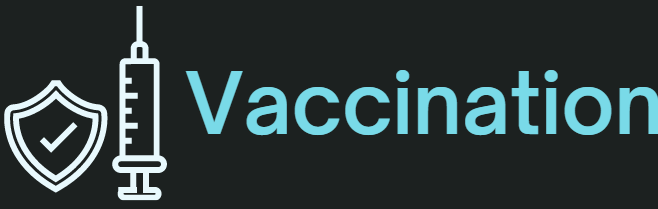
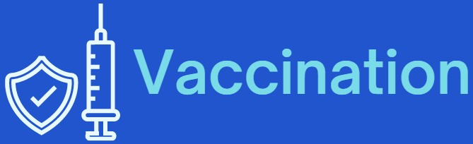

# Campaña de Vacunación

**Fecha de Solicitud:** 30 de Noviembre del 2022
 
 **Responsable(s) Solicitud:** Launch X
 
 **Descripción de Solicitud:**
- Planeación de campaña de vacunación (Un poco de mercadotecnia para llegar al sitio)
- Maquetación del sitio con HTML
- Estilos con CSS (Lo más acercado posible, pueden ser otras imágenes, íconos o colores, pero tiene que ser lo más cercano que puedas)

 **Requisitos**
 - La página debe ser similar a la siguiente: [Link del diseño by Adhiari Subekti](./imgs/landingVacunaci%C3%B3n.png)

 - Paleta de Colores
 
 

 1. rgb(232, 249, 253) E8F9FD
 2. rgb(121, 218, 232) 79DAE8
 3. rgb(10, 161, 221)  0AA1DD
 4. rgb(33, 85, 205)   2155CD

 - Logo en varios colores

   
   

 - Tecnología a Usarse:

     

 - Desplegado en:
  

 [Volver &ldca;](/Front/Practica3/README.md "Regresar a página anterior")